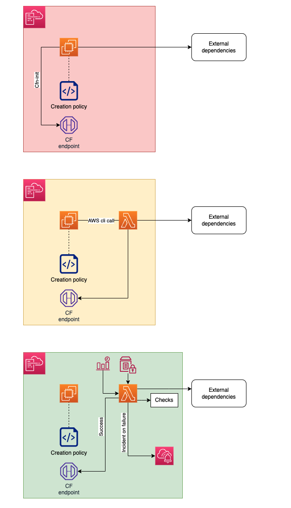

**Disclaimer: This code is not intended for production use. It is designed to explore a theoretical concept based on the assumptions outlined below. The policies and roles used herein have not been hardened, and certain design specifics may be subject to debate.**

The issue with the initial design is its strict transaction nature: a failure during recreation results in total VM loss. Recreation is often necessary when an instance's physical properties change. In a mutable environment, VMs are typically re-created from images generated on the fly. In production, it’s preferable for a server to operate with reduced functionality rather than no service. Therefore, we propose an architecture where the VM is retained even if all configurations are not successfully applied during recreation. Instead of rolling back the VM, an alarm is triggered and an incident is logged. As such, this solution can be used for the following:
- Avoid interactions between the EC2 instance and AWS during mid-life proxy configuration (e.g., for security reasons vm is hardened and denied interactions with AWS).
- Maintain a strict transactional aspect of CreationPolicy for creation and less strict for updates.
- Ensure update validation remains necessary but non-blocking, shifting the transaction responsibility elsewhere.

TODO:
- UNIT TEST
- Update the diagram to incorporate the required sequence for creating resources, ensuring the establishment of a temporal loop for both new and updated stacks.

# Temporal loop concept
Establishment of temporal loop for both new and updated stacks requires these resources to be created in the following order:
- 1
- 2
- 3 ...

# Deployment
[Check scripts/deploy_cf_readme.md](https://github.com/cloudlifter95/aws_templates/tree/main/ec2_with_external_signal/scripts/deploy_cf_readme.md)

# Unit tests
[Check functions/run_tests_readme](https://github.com/cloudlifter95/aws_templates/tree/main/ec2_with_external_signal/functions/run_tests_readme.md)
